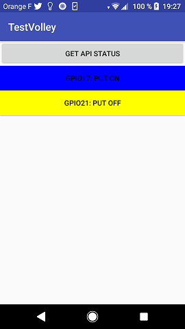

# Android Volley Basic Authent

## Description

this little Android application has been written to consume the API Rest develop in Go and available here :

[Go API Rest](https://github.com/MatGarreau/GoApiRestBasicAuth)

I use Volley library to send simple HTTP request, and HTTP request that need authentication with Basic Authent.

The screen should look like :

## Without authentication

The first button allows to send a request to the raspberry pi and get the API status (UP or DOWN)

## With authentication

The bulb buttons allows following actions :

* get the GPIO status : led is ON or OFF

* switch ON the led

* switch OFF the led

# v0.23

* use ImageButton widget rather than Button

